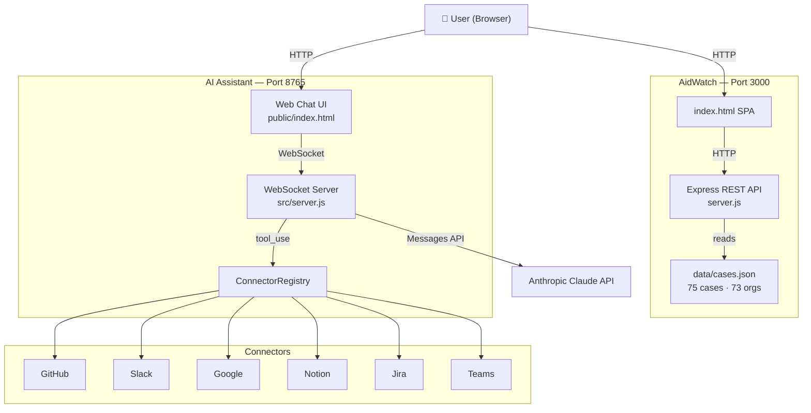

# AI Assistant Project

[](https://nodejs.org)
[](https://expressjs.com)
[](https://jestjs.io)
[](https://github.com/features/actions)
[](https://docs.docker.com/compose)
[](LICENSE)
[](https://github.com/alassistantai1-ux/ai-assistant-project/pulls)

A monorepo containing two production-ready applications:

1. **AidWatch** — Humanitarian aid accountability search engine with 75+ documented cases of fraud, corruption, and misconduct.
2. **AI Assistant Server** — WebSocket-based AI agent powered by Claude with connectors for Google, GitHub, Slack, Notion, Jira, and Microsoft Teams.

---

## Architecture



---

## Tech Stack

| Layer | Technology |
|-------|-----------|
| Runtime | Node.js 20 LTS |
| AI | Anthropic Claude (`claude-sonnet-4-6`) |
| REST API | Express 4 + Helmet + express-rate-limit |
| WebSocket | ws 8 |
| Testing | Jest 29 + Supertest |
| CI | GitHub Actions |
| Containers | Docker + Docker Compose |
| Linting | ESLint 8 |

---

## Quick Start

### Prerequisites

- Node.js >= 20
- An [Anthropic API key](https://console.anthropic.com)

### 1. Clone & install

```bash
git clone https://github.com/alassistantai1-ux/ai-assistant-project.git
cd ai-assistant-project
npm install
cd aidwatch && npm install && cd ..
```

### 2. Configure

```bash
cp .env.example .env
# Edit .env — at minimum set ANTHROPIC_API_KEY
```

### 3. Run

```bash
# Both servers in parallel (recommended)
npm run dev

# Or individually:
npm run start:aidwatch    # AidWatch  → http://localhost:3000
npm run start:server      # Assistant → http://localhost:8765
```

### 4. Docker Compose

```bash
docker-compose up --build
```

---

## AidWatch API Reference

All endpoints return `{ success: boolean, data?: any, error?: string }`.

Base URL: `http://localhost:3000`

### Core

#### `GET /health`
Server health and dataset counts.

```json
{
  "success": true,
  "data": { "status": "ok", "cases": 75, "organizations": 73, "uptime": 42 }
}
```

#### `GET /robots.txt`
Robots exclusion file (disallows `/api/cases` and `/api/search`).

---

### Search

#### `GET /api/search`

Full-text search across all cases with filters and pagination.

| Param | Type | Description |
|-------|------|-------------|
| `q` | string | Full-text query (searches org, title, country, tags, summary) |
| `type` | string | Case type exact match |
| `region` | string | Region exact match |
| `sourceType` | string | Source type (UN, INGO, Government, Multilateral) |
| `status` | string | `ongoing` \| `closed` |
| `severity` | string | `critical` \| `high` \| `medium` |
| `yearFrom` | number | Earliest case year |
| `yearTo` | number | Latest case year |
| `sort` | string | `relevance` (default) \| `newest` \| `oldest` \| `amount` \| `severity` |
| `page` | number | Page number (default: 1) |
| `limit` | number | Results per page (default: 20, max: 50) |

**Response includes** `total`, `page`, `pages`, `results[]`, `didYouMean` (when zero results).

```bash
curl "http://localhost:3000/api/search?q=procurement+fraud&region=West+Africa&sort=amount"
```

#### `GET /api/search/suggest?q=<prefix>`

Autocomplete suggestions (up to 8 matches) from case org names, titles, countries, and tags.

```json
{ "success": true, "data": { "query": "usan", "suggestions": ["USAID", "USAID Nigeria", ...] } }
```

---

### Cases

#### `GET /api/cases/:id`

Full case detail with org profile and related cases.

Returns `400` for non-numeric ID, `404` if not found.

```json
{
  "success": true,
  "data": {
    "case": { "id": 1, "title": "...", "severity": "critical", "timeline": [...] },
    "org": { "id": 1, "name": "...", "riskScore": 85 },
    "related": [...]
  }
}
```

#### `GET /api/cases/related/:id`

Related cases for a given case ID (same org or same type, max 6, sorted newest first).

```json
{ "success": true, "data": { "caseId": 1, "total": 4, "results": [...] } }
```

---

### Organizations

#### `GET /api/orgs`

All organizations ranked by computed risk score (0-100).

```json
{ "success": true, "data": { "total": 73, "results": [{ "id": 1, "name": "...", "riskScore": 92, "caseCount": 3 }] } }
```

#### `GET /api/orgs/:name`

Org profile by slug or name. Includes all cases and computed risk score.

Returns `404` if not found.

#### `GET /api/org/:id`

Org by numeric ID or slug (legacy endpoint, same as `/api/orgs/:name`).

#### `GET /api/org`

Search organizations by name. Query param: `q`.

---

### Statistics

#### `GET /api/stats`

Aggregate breakdown of all cases.

```json
{
  "success": true,
  "data": {
    "totalCases": 75,
    "totalOrgs": 73,
    "totalAmount": 485000000,
    "byType": { "Procurement Fraud": 14, "Financial Fraud": 12, ... },
    "byRegion": { "West Africa": 18, "East Africa": 12, ... },
    "byYear": { "2022": 8, "2021": 7, ... },
    "bySeverity": { "critical": 22, "high": 41, "medium": 12 },
    "byStatus": { "closed": 58, "ongoing": 17 },
    "bySource": { "donor": 35, "un": 22, "ingo": 18 }
  }
}
```

#### `GET /api/trends`

Trending case types and regions over time.

```json
{
  "success": true,
  "data": {
    "typeByYear": { "2022": { "Procurement Fraud": 3, ... } },
    "regionByYear": { "2022": { "West Africa": 4, ... } },
    "topTypes": ["Procurement Fraud", "Financial Fraud", ...],
    "topRegions": ["West Africa", "East Africa", ...]
  }
}
```

#### `GET /api/recent?n=<count>`

Most recent cases (default 8, max 50).

---

### Export

#### `GET /api/export/csv`

Download all cases as CSV (Content-Type: `text/csv`).

Headers: `id, title, org, type, region, country, year, amount, amountNum, status, severity, source, sourceUrl`

```bash
curl "http://localhost:3000/api/export/csv" -o cases.csv
```

---

### Sources & External Data

#### `GET /api/sources`
Reference list of all accountability data sources with descriptions and URLs.

#### `GET /api/external/worldbank?q=<query>`
Live World Bank debarment list search.

#### `GET /api/external/opensanctions?q=<query>`
Live OpenSanctions global sanctions database.

#### `GET /api/external/gdelt?q=<query>`
Live GDELT news coverage (accountability-filtered, 10-year window).

#### `GET /api/external/wikipedia?q=<query>`
Wikipedia summary for a search term.

#### `GET /api/external/openalex?q=<query>`
Academic papers on governance and corruption (OpenAlex).

#### `GET /api/everything?q=<query>`
All sources in parallel: local cases + sanctions + media + academic + Wikipedia.

---

### Severity Algorithm

| Level | Criteria |
|-------|----------|
| **Critical** | SEA/sexual exploitation cases; amount ≥ $50M; debarment/sanctions |
| **High** | Fraud with amount ≥ $5M; corruption; procurement diversion ≥ $10M; amount ≥ $1M |
| **Medium** | All other cases |

### Risk Score Algorithm (0–100)

For each organization: `cases × 10` + severity weights (critical=20, high=10, medium=5) + recency bonus (×1.2 for cases after 2020) + log-scale fund factor, capped at 100.

---

## AI Assistant

### Connectors

| Connector | Tools |
|-----------|-------|
| **Google** | List emails, Send email, List/Create calendar events, List Drive files |
| **GitHub** | List repos, List/Create issues, Get repo info, Search code |
| **Slack** | List channels, Send message, Get channel history, Get user info |
| **Notion** | Search, Get page, Create page, List databases |
| **Jira** | List projects, List/Search issues (JQL), Get issue, Create issue, Add comment |
| **Microsoft Teams** | List teams, List channels, Get recent messages, Send message |

### HTTP API (port 8765)

#### `GET /api/connectors`
List all registered connectors with availability status.

#### `GET /api/connectors/:name/health`
Health check for a specific connector by name.

### WebSocket Protocol

Connect to `ws://localhost:8765`. All messages are JSON.

**Client → Server:**

| `type` | Fields | Description |
|--------|--------|-------------|
| `query` | `text`, `requestId` | Send prompt to Claude |
| `connect_account` | `connector`, `credentials`, `requestId` | Connect a service |
| `disconnect_account` | `connector`, `requestId` | Disconnect a service |
| `list_connectors` | `requestId` | Get connector status |
| `new_conversation` | `requestId` | Clear conversation history |
| `status` | `requestId` | Get server status |
| `pong` | — | Heartbeat response |

**Server → Client:**

| `type` | Fields | Description |
|--------|--------|-------------|
| `connected` | `clientId` | Session established |
| `response_start` | `requestId` | Claude starting response |
| `response_delta` | `requestId`, `delta` | Streaming text chunk |
| `tool_call` | `requestId`, `tool`, `input` | Claude calling a tool |
| `response_end` | `requestId`, `usage` | Response complete |
| `account_connected` | `connector` | Connector connected |
| `account_disconnected` | `connector` | Connector disconnected |
| `connectors_list` | `available`, `connected` | Connector list |
| `conversation_cleared` | — | History cleared |
| `error` | `message` | Error occurred |
| `ping` | — | Heartbeat |

---

## Environment Variables

| Variable | Default | Description |
|----------|---------|-------------|
| `ANTHROPIC_API_KEY` | — | **Required.** Anthropic API key |
| `ANTHROPIC_MODEL` | `claude-sonnet-4-6` | Model to use |
| `PORT` | `8765` | AI Assistant port |
| `AIDWATCH_PORT` | `3000` | AidWatch port |
| `CORS_ORIGIN` | `*` | AidWatch CORS origin |
| `GOOGLE_ACCESS_TOKEN` | — | Google OAuth2 access token |
| `GOOGLE_REFRESH_TOKEN` | — | Google OAuth2 refresh token |
| `GOOGLE_CLIENT_ID` | — | Google OAuth2 client ID |
| `GOOGLE_CLIENT_SECRET` | — | Google OAuth2 client secret |
| `GITHUB_TOKEN` | — | GitHub PAT |
| `SLACK_TOKEN` | — | Slack Bot token (`xoxb-...`) |
| `NOTION_TOKEN` | — | Notion integration secret |
| `JIRA_HOST` | — | Jira cloud hostname |
| `JIRA_EMAIL` | — | Jira account email |
| `JIRA_API_TOKEN` | — | Jira API token |
| `TEAMS_ACCESS_TOKEN` | — | Microsoft Graph Bearer token |
| `RATE_LIMIT_MAX` | `120` | AidWatch API rate limit (req/min) |

---

## Testing

```bash
# Run all tests (43 tests across health, search, cases, orgs, stats, CSV, trends)
npm test

# Lint
npm run lint
```

---

## Docker Compose

```bash
# Build and start both services
docker-compose up --build

# With custom env
ANTHROPIC_API_KEY=sk-ant-... docker-compose up
```

Services:
- `aidwatch` — AidWatch API on port 3000
- `assistant` — AI Assistant on port 8765

Both include Docker `HEALTHCHECK` directives. The assistant service waits for AidWatch to be healthy before starting.

---

## Roadmap

### ✅ Completed
- 75+ documented humanitarian aid accountability cases
- Full-text search with severity scoring and filters
- Fuzzy search with "Did you mean?" suggestions
- Autocomplete suggestions endpoint (`/api/search/suggest`)
- CSV export endpoint
- Trends over time endpoint
- Risk score algorithm (0–100) per organization
- 43-test Jest suite (health, search, cases, orgs, stats, CSV, trends)
- Jira connector (list projects, search issues, get issue, create issue, add comment)
- Microsoft Teams connector (list teams/channels, get messages, send messages)
- HTTP API for connector status and health checks
- Chat UI: syntax highlighting, timestamps, copy button, typing indicator
- Docker Compose with health checks
- WCAG 2.1 AA accessibility (aria labels, focus management)
- Security hardening: request ID middleware, robots.txt, CSP headers, rate limiting

### 🔄 In Progress
- AidWatch frontend advanced features (dashboard charts, org profiles, case detail timeline)

### 📋 Planned
- OAuth2 flow for Google connector (in-browser consent flow)
- Microsoft Teams OAuth2 refresh (currently requires manual token)
- AidWatch public data API (OpenAPI spec)
- WebSocket compression
- Full-text search indexing with faster fuzzy matching (Fuse.js)
- Case submission form (public tips with moderation queue)
- Bulk CSV import for new cases
- Multi-language support (French, Spanish, Arabic)

---

## Contributing

1. Fork the repo
2. Create a branch: `git checkout -b feature/my-feature`
3. Make changes and add tests
4. Lint: `npm run lint`
5. Test: `npm test`
6. Open a pull request

Code style: single quotes, `'use strict'`, JSDoc on exported functions.

---

## License

MIT © 2024 AI Assistant Project contributors
